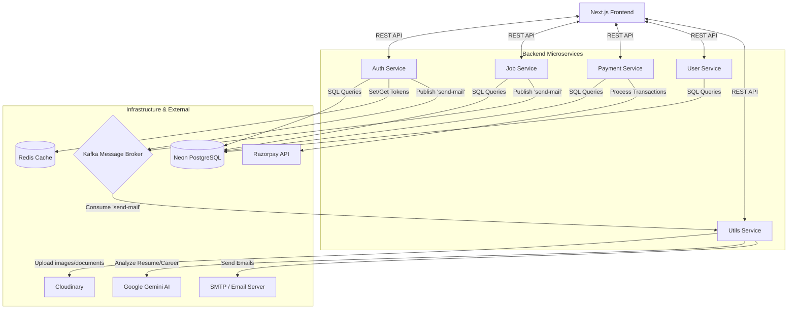
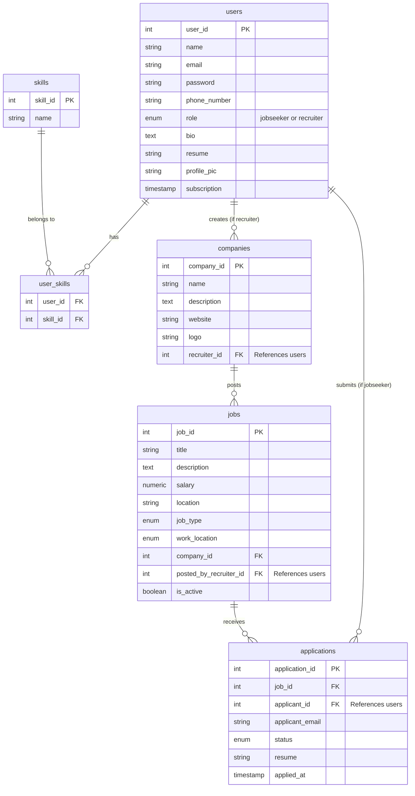

# ElevenHire - Event-Driven Microservices Recruitment Platform

Welcome to the **ElevenHire** repository. This is a comprehensive, event-driven microservices-based recruitment platform. It connects recruiters and job seekers using modern technologies and an AI-powered toolkit.

## 🚀 Tech Stack

- **Frontend**: Next.js 16, React 19, TailwindCSS 4, Radix UI Primitives
- **Backend Services**: Node.js, Express.js, TypeScript
- **Database**: PostgreSQL (Neon Serverless)
- **Caching & Sessions**: Redis
- **Message Broker (Event-Driven)**: Kafka (KafkaJS)
- **Storage/Media**: Cloudinary
- **AI Integration**: Google Gemini AI (`@google/genai`)
- **Payments**: Razorpay

---

## 🏗 Microservices Architecture

The backend is decomposed into 5 main microservices. They communicate via REST APIs and asynchronous Kafka events.

### 1. High-Level System Design



### 2. Services Overview

| Service | Description | Port | Key Technologies |
|---|---|---|---|
| **Auth** | User registration, login, JWT issuance, and password resets. Emits email events. | ? | Express, Neon, Redis, Kafka, Bcrypt, JWT |
| **Job** | Job postings, company management, application tracking. Emits email events. | ? | Express, Neon, Kafka |
| **User** | Profile management, skill updates, resume/image updates via Utils service. | ? | Express, Neon, Axios |
| **Payment** | Handles Razorpay checkouts and payment verification for subscriptions. | ? | Express, Razorpay |
| **Utils** | General utilities: Cloudinary uploads, AI Resume/Career analysis, and Kafka Mail Consumer. | ? | Express, Cloudinary, Gemini AI, Nodemailer, KafkaJS |

---

## 🗄 Database Schema (ERD)

The microservices share a PostgreSQL instance. The schema relationships are modeled below:



---

## 🔌 API Endpoints Summary

### Auth Service (`/api/auth`)
- `POST /register`: Register a new jobseeker or recruiter.
- `POST /login`: Authenticate and receive a JWT.
- `POST /forgot`: Send a password reset email (via Kafka).
- `POST /reset/:token`: Reset password using token.

### Job Service (`/api/job`)
- `POST /company/new`: Create a new company profile.
- `DELETE /company/:companyId`: Delete a company.
- `GET /company/all`: Get all companies created by the logged-in recruiter.
- `GET /company/:id`: Get company details along with its jobs.
- `POST /new`: Post a new job.
- `PUT /:jobId`: Update an existing job.
- `GET /all`: Fetch all active jobs (supports filtering).
- `GET /:jobId`: Fetch single job details.
- `GET /application/:jobId`: Get all applications for a specific job.
- `PUT /application/update/:id`: Update application status (Submits email to Kafka).

### Payment Service (`/api/payment`)
- `POST /checkout`: Generate a Razorpay order ID.
- `POST /verify`: Verify Razorpay signature and grant user subscription.

### User Service (`/api/user`)
- `GET /me`: Get current logged-in user profile.
- `GET /:userId`: Get another user's profile.
- `PUT /update/profile`: Update name, bio, phone number.
- `PUT /update/pic`: Update profile picture (calls Utils service).
- `PUT /update/resume`: Update PDF resume.
- `POST /skill/add`: Add a skill to the user.
- `PUT /skill/delete`: Remove a skill.
- `POST /apply/job`: Apply for a job.
- `GET /application/all`: Fetch all applications submitted by the user.

### Utils Service (`/api/utils`)
- `POST /upload`: Uploads a file (image/pdf) buffer to Cloudinary and returns the URL.
- `POST /career`: Uses Gemini AI to generate career paths, job options, and learning approaches based on given skills.
- `POST /resume-analyser`: Parses a base64 encoded PDF using Gemini AI to generate an ATS score and resume improvement suggestions.

---

## 📋 Running the Project Properly

### 1. Environment Variables Configuration
Ensure each microservice has a `.env` file with the expected connection strings:
- `Redis_url`, `Kafka_Broker`
- `Frontend_Url`, `UPLOAD_SERVICE`
- Database URL (`PGHOST`, `PGUSER`, `PGPASSWORD`, `PGDATABASE`, etc., as per Neon Serverless docs)
- Third-party API keys: `Razorpay_Key`, `Razorpay_Secret`, `API_KEY_GEMINI`, `SMTP_USER`, `SMTP_PASS`, Cloudinary credentials.

### 2. Run Kafka and Redis
Both Kafka and Redis must be running locally or in Docker. See `kafka-docker-setup.txt` inside `services/` for local Kafka provisioning.

### 3. Run Microservices
In each of the five service directories (`services/auth`, `services/job`, `services/payment`, `services/user`, `services/utils`), run:
```bash
npm install
npm run dev
```

### 4. Run Frontend
Navigate to the `frontend/` directory, set `.env` with backend hostnames, and run:
```bash
npm install
npm run dev
```
